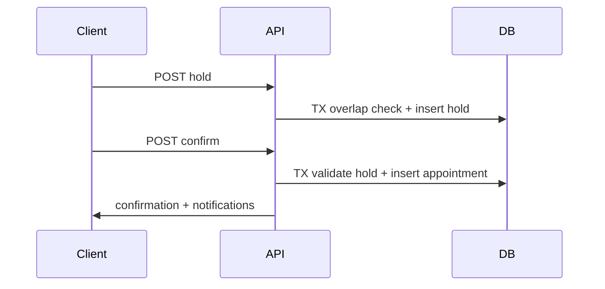

# Arquitectura

## Multi-tenant

Cada local es un registro en `tenants` identificado por `slug`. Los usuarios internos se vinculan mediante `memberships` con rol por tenant.

## Concurrencia de reservas

## Notificaciones

- Email vía Resend en eventos de turno
- WhatsApp vía Meta Cloud API cuando está habilitado por tenant
- Fallback automático a log/email si WhatsApp no está configurado

## Cache

Redis cachea slots calculados por `(tenant, staff, date, service)` con TTL corto. Se invalida al crear hold o turno.
